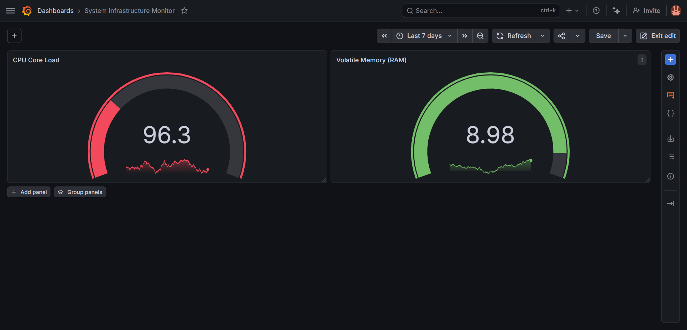

# 🖥️ Host System Infrastructure Performance Monitor

A production-grade, version-controlled **Infrastructure-as-Code (IaC)** structural layout template designed to evaluate bare-metal or virtualized server node resource stability.

## 🖼️ Dashboard Live Preview

## 📈 System Health Architecture Tracked
* **CPU Core Saturation:** Live threshold gauge monitoring active computational loads to prevent thread bottlenecks.
* **Volatile Memory (RAM) Capacity:** Visual limit thresholds tracking volatile memory footprints to preempt Out-Of-Memory (OOM) service terminations.

